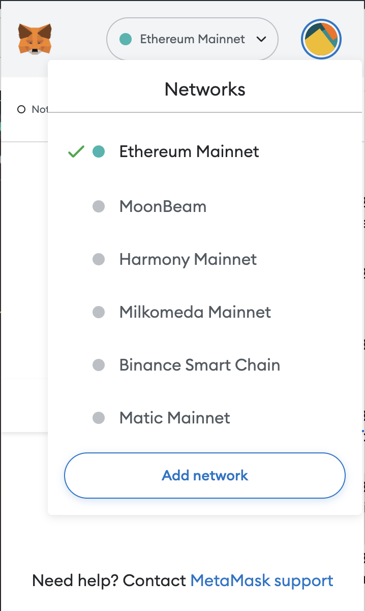

# solidity-truffle-ganache-remix

Chapter 2: Step-by-step install simulator for VM ethereum blockchain with Ganache and MetaMask. Then implement Smart Contract Solidity to Ganache.

## The Chapter
- Chapter 1: https://github.com/kecci/solidity-remix-basic
- Chapter 2: https://github.com/kecci/solidity-truffle-ganache-remix  (you in here)
- Chapter 3: https://github.com/kecci/solidity-react-truffle-box

## Table of Contents
- [solidity-truffle-ganache-remix](#solidity-truffle-ganache-remix)
  - [Step Parts](#step-parts)
  - [Table of Contents](#table-of-contents)
  - [Introduction](#introduction)
  - [Metamask](#metamask)
    - [Download, Install and Register](#download-install-and-register)
    - [Remix connect to Metamask](#remix-connect-to-metamask)
  - [Ganache](#ganache)
    - [Download \& Install](#download--install)
    - [Run Ganache](#run-ganache)
    - [Ganache connect to Metamask](#ganache-connect-to-metamask)
    - [Import Ganache Account to Metamask](#import-ganache-account-to-metamask)
    - [Send ETH between Account](#send-eth-between-account)
  - [Smart Contract Remix to Ganache](#smart-contract-remix-to-ganache)
  - [Next](#next)

## Introduction
Before we running the VM of Blockchain with ganache, we need to install metamask for our browser wallet.

## Metamask
A crypto wallet & gateway to blockchain apps.

### Download, Install and Register
Download: https://metamask.io/download/

### Remix connect to Metamask
To run Remix, we can following remix basic before: https://github.com/kecci/solidity-remix-basic

Now, we want to connect to the remix with metamask:
1. Open the remix our workspace, then compile one of the contract
2. Then go to deployment section, and choose `Injected Provider - Metamask` 
3. It will be show pop up connecting Remix to Metamask. 
4. After we submit, the `Account` and the `Wallet` would be have same address  

For now, we just want to know how to connect remix to Metamask. 

After this, we next step to `Import` the account from Local VM Ganache.

## Ganache
Personal Ethereum Blockchain. (Local VM).

### Download & Install
Download: https://trufflesuite.com/ganache/

### Run Ganache
We can following these steps:
1. Open ganache, choose `Quickstart`. 
2. We can see 10 address account simulator for each 100 eth. 
3. If we click on :key: `Key Button` We can see Account Information about the `Account Address` and `Private Key`. 

### Ganache connect to Metamask

After we running the Ganache. We can connect the network to the metamask.

Following these steps:
1. Open the Metamask. And Click on dropdown Network. 
2. Choose `Add Network` and will redirect to these settings. 
3. Choose `Add a network manually` and will open these form network. 
4. Input the network settings for `Ganache`, you can follow these input. 
   1.  Network Name: `Ganache`
   2.  New RPC URL: `HTTP://127.0.0.1:7545`
   3.  Chain ID: `1337`
   4.  Currency Symbol: `ETH`
5. Save, and we can see the Network Ganache already added. 

### Import Ganache Account to Metamask
We want to import the Ganache Account to metamask, we can follow these steps:
1. Open the account section, and choose `Import Account`. 
2. It will show the form import account. 
3. Copy the `Private Key` on Ganache before, then copy it to the metamask private key form. 
4. After that, click `Import` button. We will see the `Account Address` and `Balance` are same like as in `Ganache Account`.  We can adding multiple accounts from Ganache to Metamask.

### Send ETH between Account
After We have 2 imported account. We can simulate to send ETH between account.

Follow these steps:
1. In metamask, Click on `Send`. Then it will redirect to form send. 
2. Fill the inputs with the different account address. It will be like this. 
3. Then we set the `Amount`, and click send. For example 5 ETH. It will redirect to `Confirmation Page`. 
4. After we submit `Confirm`. We will redirect to `Transaction Queue Section`.  
5. After waiting for the pending, the transaction will be updated to History Section. 
6. Congratulations, we have successfully send the coin ! You can see also in Ganache Balance are updated. 

## Smart Contract Remix to Ganache

TBD

[Connecting Smart Contract in Remix to Ganache](https://www.youtube.com/watch?v=fRl2UA4S6dE&list=PLH1gH0TmFBBhvZi4kEqU6kCjyv_y8qBae&index=34)

## Next 
After we know the simulation of blockchain with Ganache and the Connecting Smart Contract. Next step : https://github.com/kecci/solidity-react-truffle-box
